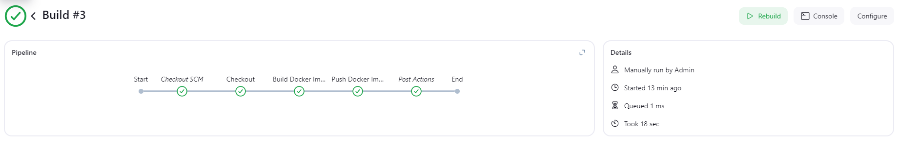
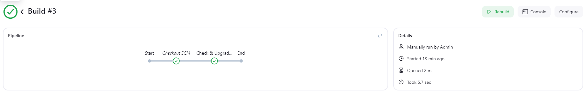
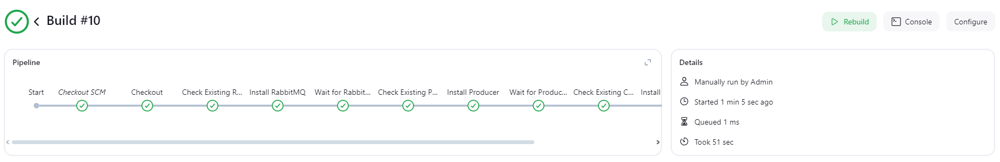

# Devops RabbitMQ Producer Consumer

## RabbitMQ management UI overview:

## Kubernetes overview:

## Log:

## Helm chart overview:

## Jenkins overview:

## CI

The CI pipelines build and push the Docker images to Docker Hub.

## CD

The CD pipelines upgrade the Helm charts and restart the pods.

## RabbitMQ Start

The start script is used to start RabbitMQ and the Helm chart.

